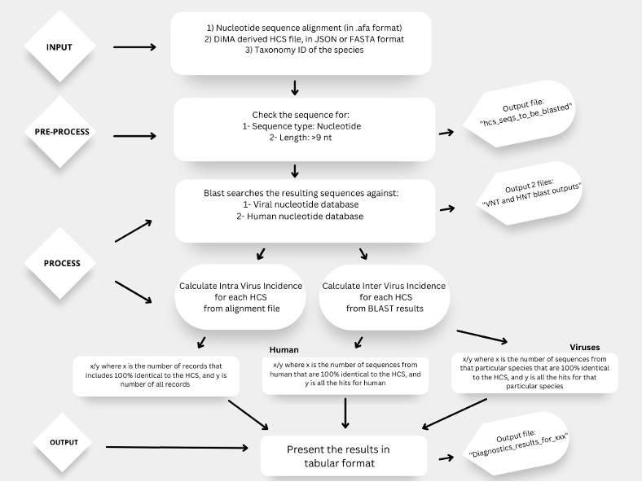

1.	About 
__________

1.1.	Diagnostics Target Analyser
~~~~~~~~~~~~~~~~~~~~~~~~~~~~~~~~~~

Here, we present DiTA, Diagnostics Target Analyser module of ViVA, a command line-based tool that aims to analyse intra and inter virus incidences of the historically conserved sequences (HSC). Intra virus incidence measures the encounter of the HCS’s within the provided alignment file, while inter virus incidence measures the encounter of HCS’s in the record of other virus species, and human databases in NCBI. The user submits a nucleotide sequence alignment file in FASTA format, HCS’s in a file in JSON or FASTA format and the TaxID of the species involved in the research. These files are pre-processed to check for type and length of nucleotides and blasted against Virus and Human databases in NCBI. Then, the records with 100% identity with HCS’s are extracted for each species and the number of %100 match is divided to number of all matches to inter virus incidence. The alignment file including the number of records is also processed and each HCS is checked in the records. The number of records including the HCS is divided to number of total records to obtain intra virus incidence. These metrics are important to understand specificity and sensitivity of the sequence and can be used to choose the HCS's that are suitable for diagnostics purposes. The tool is stored and accessible from: https://github.com/BVU-BILSAB/dita_viva. 

1.2.	Accessibility
~~~~~~~~~~~~~~~~~~~
Diagnostic tool is publicly available at: https://github.com/BVU-BILSAB/dita_viva

1.3.	Browser Compatibility
~~~~~~~~~~~~~~~~~~~~~~~~~~~

The tool can be used in Windows, MacOS and Linux systems.

____________
2.	Algorithm
_____________

____________________________
3.	Input File and Parameters
____________________________

3.1.	Input File
~~~~~~~~~~~~~~~~

DiTA uses aligned DNA sequences in .afa format. Publicly available alignment tools can be used to get the aligned file, i.e, MAFFT and MUSCLE. DiTA also requires HCS files in JSON or FASTA format produced via DiMA. 

3.2.	Parameters
~~~~~~~~~~~~~~~~

Taxonomy ID of the species of interest is required to be provided in the script. 

_______________________________
4.	How to Interpret the Results
_______________________________

Table 1. DiTA results for Spike Protein of Zaira Ebola Virus (shortened).

+-----+------------+---------------------------+--------------+-------------------------------------------------+------------------------+--------------------------------+-------------------+----------------------------+
|     | Query Name | Intra Virus Incidence (%) | HCS Sequence | Subject Scientific Name(s)                      | Subject Taxonomy ID(s) | No. of Hits with 100% Identity | No. of Total Hits | Inter Virus Incidence (%)  |
+=====+============+===========================+==============+=================================================+========================+================================+===================+============================+
| 0   | 1          | 1.1267605633802817        | ATGGGGTCAGG  | Fowlpox virus                                   | 10261                  | 33                             | 33                | 100.0                      |
+-----+------------+---------------------------+--------------+-------------------------------------------------+------------------------+--------------------------------+-------------------+----------------------------+
| 1   | 1          | 1.1267605633802817        | ATGGGGTCAGG  | Escherichia virus LS3                           | 2743777                | 1                              | 1                 | 100.0                      |
+-----+------------+---------------------------+--------------+-------------------------------------------------+------------------------+--------------------------------+-------------------+----------------------------+
| 2   | 1          | 1.1267605633802817        | ATGGGGTCAGG  | Escherichia phage vB_EcoP_Kapi1                 | 2746235                | 1                              | 1                 | 100.0                      |
+-----+------------+---------------------------+--------------+-------------------------------------------------+------------------------+--------------------------------+-------------------+----------------------------+
| 3   | 1          | 1.1267605633802817        | ATGGGGTCAGG  | Lepidopteran phenui-related virus OKIAV270      | 2746258                | 1                              | 1                 | 100.0                      |
+-----+------------+---------------------------+--------------+-------------------------------------------------+------------------------+--------------------------------+-------------------+----------------------------+
| 4   | 1          | 1.1267605633802817        | ATGGGGTCAGG  | Polar freshwater circular DNA virus             | 2749196                | 3                              | 3                 | 100.0                      |
+-----+------------+---------------------------+--------------+-------------------------------------------------+------------------------+--------------------------------+-------------------+----------------------------+
| 5   | 1          | 1.1267605633802817        | ATGGGGTCAGG  | Enterobacteria phage PPyecE_EH1910              | 2751388                | 1                              | 1                 | 100.0                      |
+-----+------------+---------------------------+--------------+-------------------------------------------------+------------------------+--------------------------------+-------------------+----------------------------+
| 6   | 1          | 1.1267605633802817        | ATGGGGTCAGG  | Escherichia phage vB_EcoM_APEC                  | 2759186                | 1                              | 1                 | 100.0                      |
+-----+------------+---------------------------+--------------+-------------------------------------------------+------------------------+--------------------------------+-------------------+----------------------------+
| 7   | 1          | 1.1267605633802817        | ATGGGGTCAGG  | Escherichia virus LS2                           | 2743776                | 1                              | 1                 | 100.0                      |
+-----+------------+---------------------------+--------------+-------------------------------------------------+------------------------+--------------------------------+-------------------+----------------------------+
| 8   | 1          | 1.1267605633802817        | ATGGGGTCAGG  | Vibrio phage vB_VnaS-AQKL99                     | 2759205                | 1                              | 1                 | 100.0                      |
+-----+------------+---------------------------+--------------+-------------------------------------------------+------------------------+--------------------------------+-------------------+----------------------------+
| 9   | 1          | 1.1267605633802817        | ATGGGGTCAGG  | Escherichia phage TM1                           | 2762279                | 1                              | 1                 | 100.0                      |
+-----+------------+---------------------------+--------------+-------------------------------------------------+------------------------+--------------------------------+-------------------+----------------------------+
| 10  | 1          | 1.1267605633802817        | ATGGGGTCAGG  | Stenotrophomonas phage phiSHP3                  | 2762285                | 1                              | 1                 | 100.0                      |
+-----+------------+---------------------------+--------------+-------------------------------------------------+------------------------+--------------------------------+-------------------+----------------------------+
| 581 | 1          | 1.1267605633802817        | ATGGGGTCAGG  | Homo sapiens' 'Homo sapiens;synthetic construct | 9606                   | 7003                           | 7003              | 100.0                      |
+-----+------------+---------------------------+--------------+-------------------------------------------------+------------------------+--------------------------------+-------------------+----------------------------+
   
4.1.	Query Name
~~~~~~~~~~~~~~~~~

The HCS's that are listed in the DiMA output are named with numbers (1,2,...) to differentiate the queries in BLAST output.

4.2.	Intravirus incidence
~~~~~~~~~~~~~~~~~~~~~~~~~~

This metric represents the incidence of the HCS within the alignment file. 

4.3.	HCS Sequence
~~~~~~~~~~~~~~~~~~

The HCS sequence of interest is given here.

4.4.	Subject Scientific Name
~~~~~~~~~~~~~~~~~~~~~~~~~~~~~

The scientific name of the species, that is found to have hits that are similar to HCS of interest.

4.5.	Subject Taxonomy ID
~~~~~~~~~~~~~~~~~~~~~~~~~

The taxonomy ID of the species, that is found to have hits that are similar to HCS of interest.

4.6.	No of Hits with 100% Identity
~~~~~~~~~~~~~~~~~~~~~~~~~~~~~~~~~~~

The number of hits belonging to the species, that are 100% identical with the HCS of interest.

4.7.	No of Total Hits
~~~~~~~~~~~~~~~~~~~~~~

The number of total hits belonging to the species, that are similar to the HCS of interest.

4.8.	Inter-virus Incidence
~~~~~~~~~~~~~~~~~~~~~~~~~~~

This metric represents the incidence of the HCS of interest in the specific species. 
___________________
5.	FAQs and Support
___________________

There are 4 output files generated while using this tool:

1- HCS files to be blasted: It is generated as the input file of BLAST, after checking the suitability of HCS's.

2- VNT results: BLAST output of the HCS's, queried in all records of Viruses in NCBI database.

3- HNT results: BLAST output of the HCS's, queried in all records of Homo Sapiens in NCBI database.

4- Diagnostics results: The main result table of DiTA.

5.1.	How to cite?
~~~~~~~~~~~~~~~~~~

Esra Büşra Işık, Mohammad Asif Khan, DiTA: Diagnostics Target Analyser, https://github.com/BVU-BILSAB/dita_viva.

5.2.	Support
~~~~~~~~~~~~~

Please don’t hesitate to reach out to the developers for your questions, comments, or other feedback through mailing esbusraisik@gmail.com

